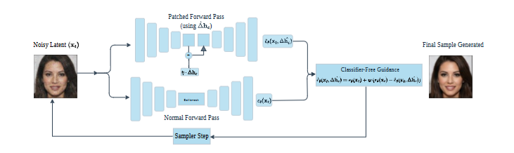
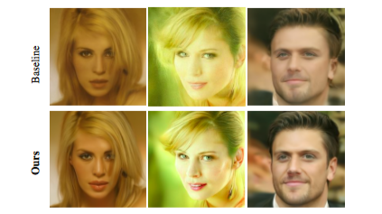

# Guidance for Low-Level Perceptual Editing in Unconditional Diffusion Models

**Generative Models for Computer Vision Workshop @ CVPR 2026**

[](https://arxiv.org/abs/2605.31162)
[](https://github.com/dsgiitr/uncond-diffusion-enhancement)
[](LICENSE)

> [!NOTE]
> This repository contains the official PyTorch implementation for our CVPR 2026 Workshop paper. We provide the complete code for inference-time perceptual editing of unconditional diffusion models without any model retraining, along with scripts to extract h-space degradation concepts.

## Motivation

Unconditional diffusion models have emerged as a powerful state-of-the-art paradigm for image synthesis, yet steering them toward aesthetically enhanced outputs for **low-level perceptual editing** (e.g., sharpness, contrast, saturation) remains largely unexplored. 

While the U-Net bottleneck (h-space) has proven to be a semantically dense latent space for linear manipulation, we show that **h-space patching—the dominant paradigm for training-free diffusion editing—systematically fails** when applied to global, low-level transformations required for aesthetic refinement.

We identify the root cause of this failure as **destructive interference** in the decoder of the U-Net, and propose a unified inference-time editing paradigm to overcome it.

> [!IMPORTANT]
> The result is a **generalized, training-free framework** that operates on low-level features by combining bottleneck patching with classifier-free guidance. This actively guides the generative sampling trajectory *away* from the degraded manifold, producing consistently improved images without any model retraining.

## Method Overview

<p align="center">
  
</p>

Our framework bypasses decoder collapse by routing the intermediate representations through a dual-path forward architecture at each sampler step:

**(1) Normal Forward Pass.** The noisy latent $x_t$ undergoes standard unconstrained generation, outputting the default noise prediction $\epsilon_\theta(x_t)$.

**(2) Patched Forward Pass.** We isolate the target low-level degradation concept vector $\Delta h_c$ within the U-Net bottleneck. Instead of replacing the representation directly, we subtract a scaled factor of the concept to shift the bottleneck state into a degraded manifold:

$$\Delta \hat{h}_c = h_t - \eta \cdot \Delta h_c$$

This yields a structurally degraded reference noise prediction $\epsilon_\theta(x_t, \Delta \hat{h}_c)$.

**(3) Negative Classifier-Free Guidance.** We treat the patched output as our negative baseline conditions. By projecting the trajectory *away* from this degraded space, the model dynamically sharpens features and refines contrast:

$$\tilde{\epsilon}_\theta(x_t, \Delta \hat{h}_c) = \epsilon_\theta(x_t) + w \Big(\epsilon_\theta(x_t) - \epsilon_\theta(x_t, \Delta \hat{h}_c)\Big)$$

where $w$ represents the guidance scale factor. The final guided vector is then fed back into the Sampler Step.

## Examples

> [!TIP]
> Our method successfully recovers sharp structural lines, optimized illumination, and vivid micro-details without shifting the underlying facial identity or injecting synthetic artifacts.

<p align="center">
  
</p>

---

## Main Results

Quantitative evaluation demonstrating performance across perceptual adjustment directions. Relative changes ($\%\Delta$) for FID are computed with respect to the baseline (lower is better). For domain-specific quality metrics (Laplacian variance, Mean S-channel, and RMS contrast), higher values denote stronger feature enhancement.

| Direction | Metric | Baseline | Standard Patching | Ours |
| :--- | :--- | :---: | :---: | :---: |
| **Sharpness** | FID ($\%\Delta$) | 25.43 | +3.54% | **-6.07%** |
| | Laplacian variance | 143.77 | 212.72 | **386.45** |
| **Saturation** | FID ($\%\Delta$) | 25.43 | +7.03% | **-7.76%** |
| | Mean S-channel | 0.43 | 0.44 | **0.47** |
| **Contrast** | FID ($\%\Delta$) | 25.43 | +4.85% | **-13.90%** |
| | RMS contrast | 0.18 | 0.17 | **0.21** |

*Note: Standard h-space patching introduces structural artifacts that degrade FID performance, whereas our negative-guidance framework achieves substantial distribution alignment improvements alongside noticeable perceptual gains.*

---

## Analysis & Ablation

### Destructive Interference in the Decoder

We demonstrate that classical bottleneck patching fails for low-level perceptual tasks because direct intervention in h-space causes structural collapse in the decoder when propagating global photometric transformations. By offloading the intervention to the CFG mechanism, our method preserves structural integrity while achieving the desired perceptual shift.

### Time-Dependent Guidance Schedules

To mitigate the computational cost of dual forward passes required by CFG, we experimented with time-dependent guidance schedules during the reverse diffusion process. Applying our guided patching exclusively during specific intervals is sufficient to anchor the perceptual enhancements, significantly decreasing inference time without sacrificing aesthetic quality.

### Semantic Generalization & Transferability

Because our inference method builds upon generalized h-space manipulations, it supports both low-level perceptual enhancements and broader semantic concept editing. We perform ablations showing our method's strong transferability across datasets.

---

## Quick Start

### 1. Installation

```bash
git clone [https://github.com/dsgiitr/uncond-diffusion-enhancement.git](https://github.com/dsgiitr/uncond-diffusion-enhancement.git)
cd uncond-diffusion-enhancement
pip install -r requirements.txt
 ```

## Extract a Concept Vector

###You can extract concept vectors using either transformation-based settings or discrete attribute configurations:
```bash
# Transformation-based (e.g., sharp vs. blur)
python extraction/get_dom_vector.py \
    --concept sharp_vs_blur \
    --timestep 20 \
    --num_samples 500 \
    --dataset_profile celeba_hq \
    --dataset_dir celeba_hq_dataset \
    --output_dir vectors

# Attribute-based (e.g., Smiling)
python extraction/get_dom_vector.py \
    --concept Smiling \
    --timestep 20 \
    --dataset_dir celeba_hq_dataset \
    --output_dir vectors
```


##Generate Guided Images
### Pass the extracted vector file along with your desired vector scale and negative guidance parameter thresholds to run generation:
```bash
python generation/main.py \
    --v-path vectors/sharp_vs_blur_dom_t20.pt \
    --v-scale 2.0 \
    --cfg-scale 5.0 \
    --steps 50 \
    --seed 42 \
    --output-dir outputs/sharp_guided
```
##Run Evaluation

```bash
# CLIP score evaluation
python evaluation/evaluate_clip.py \
    --attribute Male \
    --prompt "A photo of a male face" \
    --n-samples 64

# FID evaluation
python evaluation/evaluate_fid_folders.py \
    --real-dir path/to/real/images \
    --gen-dir path/to/generated/images
```

## Run Analysis Experiments
###Run Taylor decomposition evaluations or combined feature landscape analysis to study activation trajectories:
 ``` bash
# Taylor decomposition
python analysis/taylor_decomposition.py

# Attention entropy + Taylor combined
python analysis/combined_entropy_taylor.py \
    --run_entropy --run_taylor \
    --batch_size 128 --taylor_batch_size 32
```
 
## Citation 
### If you find this code or our paper useful in your research, please cite:
```bash
@misc{modi2026guidancelowlevelperceptualediting,
      title={Guidance for Low-Level Perceptual Editing in Unconditional Diffusion Models}, 
      author={Shreyansh Modi and Akshat Tomar and Aarush Aggarwal},
      year={2026},
      eprint={2605.31162},
      archivePrefix={arXiv},
      primaryClass={cs.CV},
      url={https://arxiv.org/abs/2605.31162}, 
}
 ```